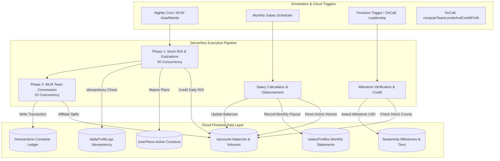

# Philippine Stock Exchange (Cloud Functions Settlement Engine)

[](https://firebase.google.com/docs/functions)
[](https://nodejs.org)
[](https://firebase.google.com/docs/firestore)
[](https://cloud.google.com/scheduler)
[](LICENSE)

> Serverless financial settlement and affiliate career engine powering the Philippine Stock Exchange ecosystem, orchestrating nightly stock ROI accruals, 8-tier direct business salary programs, rank milestone bonuses ($100 to $300,000), and multi-level team commissions.

---

## 📖 Overview

The **PSE Cloud Functions** repository provides the automated financial processing layer for the Philippine Stock Exchange fintech application. Built on **Firebase Cloud Functions v2**, **Node.js 20**, and **Cloud Firestore NoSQL**, this suite executes automated nightly batch settlements at midnight (Asia/Manila time), manages leadership career progressions, disburses recurring monthly salary stipends, and exposes low-latency callable endpoints for downline graph traversals.

### System Responsibilities
- **Stock ROI Accrual & Contract Maturation**: Computes daily percentage yields on active stock contracts, returning principal upon maturity with atomic ledger logging.
- **8-Tier Monthly Leadership Salary Program**: Evaluates direct active downline volume ($1,500 to $100,000+) to distribute automated monthly executive stipends ($50 to $12,000/month).
- **Career Milestone Bonus Engine**: Tracks active direct member counts (50 to 50,000 directs) and dispenses one-time career achievement bonuses up to $300,000.
- **Hierarchical MLM Affiliate Settlements**: Traverses multi-level referral networks and disburses commission splits according to dynamic Firestore configurations.
- **Idempotency & Concurrency Safeguards**: Uses double-entry guard collections (`/dailyProfitLogs`, `/salaryLogs`) and exponential transaction backoffs to prevent race conditions.

---

## 🏗️ Architecture & Cron Lifecycle



---

## ✨ Serverless Modules Breakdown

### 1. 📈 `nightlyRoiAndTeam.js` — Nightly Stock ROI & MLM Commissions
- **Schedule**: `0 0 * * *` (Daily at 00:00 Asia/Manila, PHT).
- **Phase 1 (Stock Contracts)**: Throttled 50-way concurrency using `p-limit`. Credits daily returns, checks contract expiration, marks `stock_expired`, returns invested principal, and writes `daily_profit` transaction documents.
- **Phase 2 (Multi-Tier Commissions)**: Traverses downline networks across dynamic `/teamSettings` tiers, calculating upline commissions and logging `team_profit`.

### 2. 💼 `salaryProfileScheduler.js` — Monthly Salary Program
- **Trigger**: Cloud Scheduler recurring cron and manual callable endpoint.
- **Tier Evaluation**: Computes direct active downline volume (`accounts.investment.totalDeposit` for `status == "active"`):
  - Tier 1: $1,500 Vol $\rightarrow$ $50 / month
  - Tier 2: $2,000 Vol $\rightarrow$ $100 / month
  - Tier 3: $4,000 Vol $\rightarrow$ $250 / month
  - Tier 4: $7,000 Vol $\rightarrow$ $500 / month
  - Tier 5: $15,000 Vol $\rightarrow$ $1,200 / month
  - Tier 6: $30,000 Vol $\rightarrow$ $2,500 / month
  - Tier 7: $50,000 Vol $\rightarrow$ $5,000 / month
  - Tier 8: $100,000+ Vol $\rightarrow$ $12,000 / month
- **Idempotent Periods**: Uses `YYYY-MM` period keys to prevent duplicate monthly salary disbursements.

### 3. 🎖️ `leadershipBonus.js` — Career Milestone Rewards
- **Milestone Matrix**:
  - 50 Actives $\rightarrow$ **$100 Bonus** | 100 Actives $\rightarrow$ **$200 Bonus** | 500 Actives $\rightarrow$ **$1,500 Bonus**
  - 1,000 Actives $\rightarrow$ **$4,000 Bonus** | 5,000 Actives $\rightarrow$ **$25,000 Bonus** | 10,000 Actives $\rightarrow$ **$60,000 Bonus**
  - 30,000 Actives $\rightarrow$ **$150,000 Bonus** | 50,000 Actives $\rightarrow$ **$300,000 Bonus**
- **Transactional Safety**: Stores awarded milestone IDs in `/leadership/{userId}` within an atomic transaction.

### 4. 🌲 `computeTeamLevelsAndCreditProfit.js` — Referral Tree Traversal
- **Trigger**: HTTPS Callable v2 (`onCall`).
- **Graph Algorithm**: Chunked breadth-first query algorithm (`chunk10`) returning full hierarchical member data for instant mobile UI rendering.

---

## 🛠️ Technical Stack Matrix

| Component | Technology | Description |
|---|---|---|
| **Platform** | Firebase Cloud Functions v2 / GCP | High-performance serverless microservices |
| **Runtime** | Node.js 20.x | Modern JavaScript runtime |
| **SDK** | `firebase-admin`, `firebase-functions` | Firestore NoSQL Admin API and v2 triggers |
| **Concurrency Control** | `p-limit` | Concurrency limiting for asynchronous batch pipelines |
| **Database** | Google Cloud Firestore | Distributed NoSQL document database |
| **Scheduler** | Google Cloud Scheduler | Reliable cron engine (PHT timezone) |

---

## 🚀 Getting Started

### Prerequisites
- **Node.js 20 LTS** or higher.
- **Firebase CLI** (`npm install -g firebase-tools`).
- Firebase project with **Firestore** and **Cloud Functions** enabled.

### Installation & Deployment

1. **Clone the Repository**:
   ```bash
   git clone https://github.com/shayann07/PSE-Cloud-Functions.git
   cd PSE-Cloud-Functions
   ```

2. **Install Node Packages**:
   ```bash
   npm install firebase-admin firebase-functions p-limit
   ```

3. **Configure Project**:
   ```bash
   firebase login
   firebase use <your-project-id>
   ```

4. **Deploy Serverless Functions**:
   ```bash
   # Deploy all functions
   firebase deploy --only functions

   # Deploy individual modules
   firebase deploy --only functions:nightlyRoiAndTeam,functions:salaryProfileScheduler
   ```

---

## 📄 License

This project is open-source software licensed under the [MIT License](LICENSE) — Copyright (c) 2026 [shayann07](https://github.com/shayann07).
